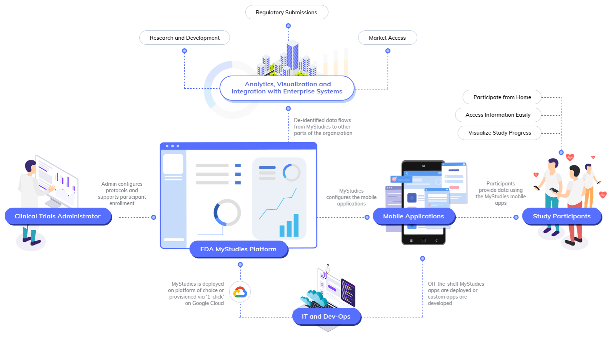

# FDA MyStudies
## Overview

The FDA’s MyStudies platform enables organizations to quickly build and deploy studies that interact with participants through purpose-built apps on iOS and Android. MyStudies apps can be distributed to participants directly (for example, when collecting patient-reported outcomes in support of a traditional clinical trial), or made available through the App Store and Google Play (for large-scale open-enrollment studies).

This open-source repository contains all of the code necessary to run FDA MyStudies on the infrastructure of choice. Optional open-source [deployment tools](Terraform/README.md) are included for semi-automated deployment to Google Cloud Platform (GCP). These tools stand up an FDA MyStudies implementation in 1 hour, and are designed with specific compliance guidelines in mind, making the end-to-end compliance journey easier for organizations.

Upon completing deployment, FDA MyStudies platform components will be available for use. A summary of these components is below.<!-- – a detailed overview of the platform architecture can be found [here](documentation/architecture_overview.md).-->

<table>
  <tr>
   <td><strong>Component</strong>
   </td>
   <td><strong>Intended users</strong>
   </td>
   <td><strong>Purpose</strong>
   </td>
  </tr>
  <tr>
   <td>Study Builder
   </td>
   <td>Study designers
   </td>
   <td>User interface for authoring and publishing studies with no software development
   </td>
  </tr>
  <tr>
   <td>Participant Manager
   </td>
   <td>Study coordinators
   </td>
   <td>User interface for coordinators to manage participant enrollment (not yet available)
   </td>
  </tr>
  <tr>
   <td>Mobile Apps
   </td>
   <td>Study participants
   </td>
   <td>iOS and Android apps that participants use to discover, enroll and interact with studies
   </td>
  </tr>
  <tr>
   <td>Response Datastore
   </td>
   <td>Researchers & analysts

(back-end component)
   </td>
   <td>Collects and stores study activity responses for downstream analysis (no PII)
   </td>
  </tr>
  <tr>
   <td>Study Datastore
   </td>
   <td>(back-end component)
   </td>
   <td>Manages study configurations (e.g. questionnaire content and schedule)
   </td>
  </tr>
  <tr>
   <td>Participant Datastore
   </td>
   <td>(back-end component)
   </td>
   <td>Manages participant information and any PII (e.g. contact information, consent forms)
   </td>
  </tr>
  <tr>
   <td>Auth Server
   </td>
   <td>(back-end component)
   </td>
   <td>Manages account creation, login, logout, resource requests, etc.
   </td>
  </tr>
</table>

<!--  -->

## Use-cases

FDA MyStudies is a flexible framework that enables diverse use-cases across a range of organizations and industries.

Examples for how FDA MyStudies can be used include: 

<table>
  <tr>
   <td><strong>Sample industries</strong>
   </td>
   <td>
    <strong>Example use-cases</strong>
   </td>
  </tr>
  <tr>
   <td>Pharma and medtech
   </td>
   <td><ul>

<li>Replace paper forms and binders of PRO questionnaires for clinical trial participants
<li>Complement in-person / traditional studies with digital surveys and other instruments
<li>Conduct virtual studies with massive reach and high patient engagement
<li>Collect valuable data on real-world impact with ‘beyond-the-pill’ companion apps
<li>Operate HEOR and post-market surveillance studies
<li>Monitor patient satisfaction and adverse events</li></ul>

   </td>
  </tr>
  <tr>
   <td>Payers, providers and public health
   </td>
   <td><ul>

<li>Develop new digital instruments
<li>Conduct large research studies quickly and efficiently
<li>Establish long-term patient registries
<li>Assess the efficacy of care management methodologies
<li>Measure prevalence and impact of infectious disease at scale
<li>Monitor efficacy of health care systems or specific initiatives</li></ul>

   </td>
  </tr>
  <tr>
   <td>Cross-industry
   </td>
   <td><ul>

<li>Measure customer satisfaction
<li>Evaluate employee / student behavior health and wellbeing</li></ul>

   </td>
  </tr>
</table>

## Repo organization

This repository contains all code required to setup and run FDA MyStudies. This includes backend services, mobile applications, deployment tools and the necessary documentation. 

There are high-level directories for quick-start guides (`/documentation`) and deployment related files in `/deployment`. 

The remaining high-level directories are each dedicated to an application component (for example `/Android` and `/iOS` contain code for the mobile applications, while `/auth-server-ws` contains code for the Auth server).

Each high-level directory contains a readme, build / deployment instructions, dockerfile, cloudbuild config and deployment configuration files (as needed).

## Data and compliance

FDA MyStudies is designed so that all data stays within the deploying organization’s environment (unless that organization chooses to export their data). Identifiable data (if collected) is stored separately from study and response data to help organizations minimize access to that data.

The FDA MyStudies platform has been designed to support auditing requirements for compliance with 21 CFR Part 11, allowing the platform to be used for trials under Investigational New Drug (IND) oversight. If an organization chooses to run FDA MyStudies on Google Cloud, a variety of infrastructure options are available that support HIPAA and other compliance requirements. More information about compliance on Google Cloud and an up-to-date list of products covered under BAA can be found [here](https://cloud.google.com/security/compliance/hipaa/).

In addition to the platform, the [tools for deployment](deployment/README.md) on GCP are designed to assist organizations in their end-to-end compliance journey. Although achieving compliance is the responsibility of the customer, these toolkits enable organizations to deploy FDA MyStudies in a way that will help meet compliance requirements; such as setting up audit logs for retaining data. 

Google Cloud can support customer compliance with 21 CFR Part 11 regulations when using GCP services in a prescribed manner to handle related data and workloads. While Google has a cloud technology stack ready for many 21 CFR Part 11 compliant workloads, the ultimate compliance determination depends on configuration choices made by the customer.

## What’s changed?

While the overall goals, compliance principles and functionality are similar, this release introduces several changes from version 2019.10 of FDA MyStudies:

*   Architecture
    *   Migrated from a VM architecture to a modular container-based architecture
    *   Refactored Participant Datastore
    *   Migrated to permissive open-source dependencies
    *   Removed dependencies that require commercial licenses
    *   Simplified mobile app calls and moved some functionality server-side
    *   Improved alignment of responsibilities between components
    *   Adjusted data storage based on usage and security requirements (e.g. study and participant status storage and calls were moved to Response Datastore, enrollment generation logic was moved to Participant Datastore)
    
*   Security
    *   Improved the existing authentication in place (e.g. removed application secret from being transmitted in all calls, unified the process into a single auth server)
    *   Added HTTPs across codebase
<!--    *   Fixed potential cross site scripting vulnerabilities -->
    
*   Usability
    *   Simplified screens within the Mobile Apps and Study Builder
    *   Updated text for clarity throughout Mobile Apps and Study Builder
    *   Removed hard-coded values to enable customization of the platform 
    *   Improved code readability to support 3rd-party adoption
<!--    *   Added support for unit testing, linter and CI/CD -->
    
*   Bug fixes
    *   Fixed minor stability and usability bugs throughout

## Feedback

Additional functionality will be added over time. Feature requests and bug reports should be submitted as [Github Issues](https://github.com/GoogleCloudPlatform/fda-mystudies/issues). All feedback is greatly appreciated.
