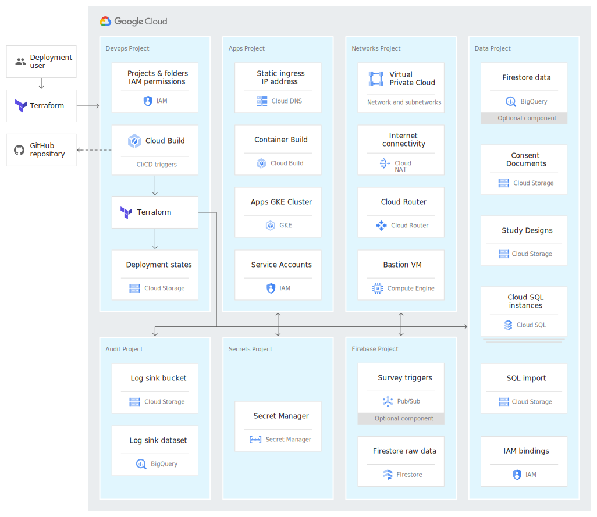

# Platform Overview

## Introduction

FDA MyStudies consists of several components that work together as a platform. These components include web-based UIs for building studies and enrolling participants, back-end services for managing the flow of data, and mobile applications that participants use to discover, enroll and participate in studies.

This document describes the architecture of FDA MyStudies. It outlines the various platform components and their roles, interdependencies and interactions

## Architecture

The diagram above illustrates the various applications that comprise the FDA MyStudies platform. The Android and iOS mobile applications are not shown. The diagram below illustrates how these applications fit into a production deployment that considers security, devops and data governance.

## Terminology

Some of the terms used in this document include:

1.  *Participant*: A mobile app user is referred to as a participant when he/she enrolls into a study and is associated with a unique participant id. A single mobile app user can be associated with multiple studies and is a unique participant in each study.
1.  *Administrator*: Users of the `Study builder` UI and `Participant manager` UI are referred to as administrators. These administrators could be researchers, clinical coordinators, sponsor personnel or site investigators and staff. 
1.  *Study content*: All the content that is required to carry out a study, which could include study eligibility criteria, consent forms, questionnaires or response types.
1.  *Response data*: The responses provided by a participant to questionnaires and activities that are presented as part of a study.

## Platform components

The platform components are as follows:

-  Administrative interfaces
   1. [Study builder](/study-builder/) (UI) to create and configure studies
   1. [Participant manager](/participant-manager) (UI) to enroll sites and participants
-  Security and access control
   1. [Hydra](/hydra/) for token management and OAuth 2.0
   1. [Auth server](/auth-server/) for login and credentials management
-  Data management
   1.  [Study datastore](/study-datastore/) to manage study configuration data
   1.  [Participant manager datastore](/participant-manager-datastore/) to process enrollment and consents
   1.  [Participant datastore](/participant-datastore/) to manage sensitive participant data
   1.  [Response datastore](/response-datastore/) to manage pseudonymized study responses
-  Participant interfaces
   1.  [Android](/Android/) mobile application (UI) to join and participate in studies
   1.  [iOS](/iOS/) mobile application (UI) to join and participate in studies 

Each of the components runs in its own Docker container. Blob storage, relational databases and a document store provide data management capabilities. Centralized logging enables auditing and identity and access control compartmentalizes the flow of data. The specific technologies used to fulfil these roles is up to the deploying organization, but in the interest of simplicity, these guides describe an implementation that leverages Google Cloud Platform services. The [deployment guide](/deployment/) and individual component [READMEs](/documentation/) provide detailed instructions for how to set up and run the platform using these services. You might use one or more of the following cloud technologies:
- Container deployment
  -  Google Kubernetes Engine (the Kubernetes approach to deployment is described in the automated [deployment guide](/deployment/))
  - Google Compute Engine (the VM approach to deployment is described in the individual component [READMEs](/documentation/))
- Blob storage
  - [Cloud Storage](https://cloud.google.com/storage) buckets for (1) study content and (2) participant consent forms
- Relational database
  - [Cloud SQL](https://cloud.google.com/sql/) databases for (1) study configuration data, (2) sensitive participant data, (3) pseudonymized participant activity data, (4) Hydra client data and (5) user account credentials  
- Document store
  -  [Cloud Firestore](https://cloud.google.com/firestore) for pseudonymized participant response data
- Audit logging
  -  [Operations Logging](https://cloud.google.com/logging) for audit log writing and subsequent analysis
- Identity and access management
  - [Cloud IAM](https://cloud.google.com/iam) to create and manage service accounts and role-based access to individual resources
- Networking
  -  [Cloud DNS](https://cloud.google.com/dns) to manage domains
  -  [Virtual Private Cloud](https://cloud.google.com/vpc) to control ingress 
- Devops
  -  [Secret Manager](https://cloud.google.com/secret-manager) for generation, rotation and distribution of secrets
  -  [Cloud Build](https://cloud.google.com/cloud-build) for CI/CD
  -  [Container Registry](https://cloud.google.com/container-registry) for management of container images

Detailed information about the components and instructions for configuration can be found the README of [each directory](/documentation/). An explanation of how the platform components relate to one another is provided below.

### Study configuration

The [`Study builder`](/study-builder/) application provides a user interface for study administrators to create and launch studies and to manage study content during the course of a study. It does not handle any patient or participant information. It only deals with study content and configuration.
<br\>
The `Study builder` is the source of study configuration for all downstream applications. As an administrator uses the UI to author their study, that study configuration data is written to a MySQL database that is shared with the [`Study datastore`](/study-datastore/). Once the administrator publishes their study, the `Study builder` notifies the [`Participant datastore`](/participant-datastore/) and [`Response datastore`](/response-datastore/) that new study information is available. Those datastores then retrieve the updated study configuration data from the `Study datastore`. When study administrators upload binary files to the `Study builder`, such as PDF documents or study images, those files are stored in blob storage. The participant mobile applications retrieve study configuration data from the `Study datastore` and the necessary binaries from blob storage directly. The `Study builder` uses built-in authorization and sends emails to study administrators for account creation and recovery purposes.

### Participant enrollment 

The [`Participant manager`](/participant-manager/) application provides a user interface for study administrators to create study sites and invite participants to participate in specific studies. The [`Participant manager datastore`](/participant-manager-datastore/) is the backend component of the `Participant manager` UI. The `Participant manager datastore` shares a MySQL database with the `Participant datastore`. As administrators use the UI to modify sites and manage participants, changes are propagated to the `Participant datastore` through the shared database.
<br\>
When a new participant is added using the `Participant manager`, the `Participant manager datastore` sends an email to the participant with a link that can be used to enroll in the study. In the case of an *open enrollment* study, participants will be able to discover and join studies even without a specific invitation. The participant goes to the mobile application to create an account, which uses the [`Auth server`](/auth-server/) to provide the necessary backend services. The `Auth server` sends the request for account creation to the `Participant datastore` to confirm that there is a study associated with that mobile application, and if confirmed, the `Auth server` validates the participant’s email and creates the account.
<br\>
The mobile application populates the list of available studies by making requests to the `Study datastore`. When a participant selects a study to join, the mobile application retrieves the study eligibility questionnaire from the `Study datastore`. In the case where the participant was invited using the `Participant manager`, the mobile application confirms the invitation is valid with the `Participant datastore`. Once the `Participant datastore` determines that the participant is eligible for the study, the mobile application retrieves the study’s consent form from the `Study datastore`. After completion, the mobile application sends the consent form to the `Participant datastore`, which writes the consent PDF to blob storage. The participant is then enrolled in the study and a record is created for them in both the `Participant datastore` and `Response datastore`.

### Ongoing participation

The mobile application retrieves the list of study activities and the study schedule from the `Study datastore`. The mobile application posts updates to the `Response datastore` as participants start, pause, resume or complete study activities. The `Response datastore` writes this study activity data to its MySQL database. When the participant completes a study activity, the mobile application posts the results of that activity to the `Response datastore`, which writes that response data to Cloud Firestore.
<br\>
If a participant sends a message with the mobile application’s contact form, that message is posted to the `Participant datastore`, which then sends an email to the configured destination. The `Participant datastore` can send participation reminders or other types of notifications to study participants through the mobile applications. When participants navigate to the dashboarding section of the mobile application, the mobile application will make a request to the `Response datastore` for the necessary study responses that are used to populate the configured dashboard. 

## Deployment and operation

Detailed deployment instructions can be found in the [deployment guide](/deployment/) and in each of the [directory READMEs](/documentation/). More information about authorization and security can be found in the [auth overview](/documentation/auth.md).
