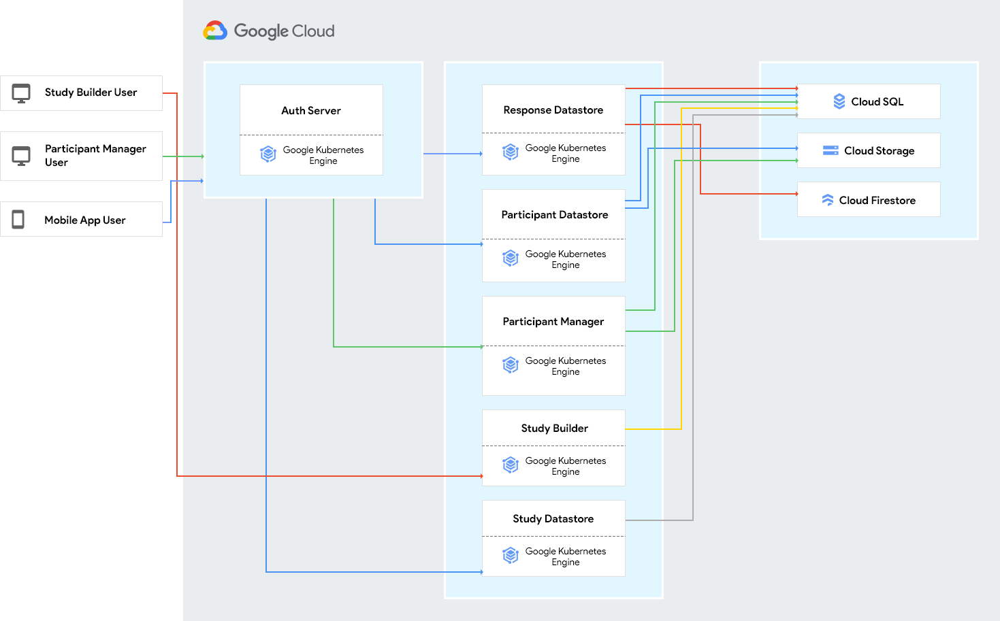

# Architecture Overview

## Introduction

FDA MyStudies consists of several components that work together as a platform. These components include web-based UIs for building studies and enrolling participants, back-end services for managing the flow of data, and mobile applications that participants use to discover, enroll and participate in studies.

This document describes the architecture of FDA MyStudies. It outlines the various platform components and their roles, interdependencies and interactions

## Architecture Diagram

## Terminology

Some of the terms used in the document and to what they refer:

1.  Participant - A mobile app user is referred to as a participant when he/she enrolls into a study and is associated with a unique participant id. A single mobile app user can be associated with multiple studies and is a unique participant in each study
1.  Administrator - Users of the Study Builder UI and Participant Manager UI are referred to as administrators. These administrators could be researchers, clinical coordinators or be associated with other non-participant roles
1.  Study Content – All the content that is required to carry out a study (e.g. study eligibility criteria, consent forms, questionnaires, response types, etc.)
1.  Response Data – Responses provided by a participant to questionnaires and activities set up as the part of a study

## Architecture Components

The platform components are as follows:

1.  Study Builder (UI)
1.  Study Datastore
1.  Auth Server
1.  Participant Manager (UI, targeted for future release)
1.  Participant Datastore
1.  Response Datastore
1.  Mobile Apps (UI, not a server component)

### Study Builder

The Study Builder provides a user interface for study administrators to create and launch studies and to manage study content during the course of a study.

The Study Builder does not handle any patient/participant information. It only deals with content for studies.

The Study Builder is the source of study information for all downstream applications. This information is provided through the Study Datastore, described in the section below.

The Study Builder is a Java application built on the Spring framework. The backend database is a MySQL database, which is shared with the Study Datastore. The application has a built-in authentication and authorization functionality.

When deploying the application on GCP, the cloud resources used are:

1.  Google Kubernetes Engine (GKE)
1.  Cloud SQL (MySQL)

### Study Datastore

The Study Datastore provides REST APIs for downstream client applications to obtain all content related to studies set up using the Study Builder.

It uses basic authentication with API username and password keys provided to client applications. 

The Study Datastore does not handle or expose any user/participant information. It provides study content only.

It is a Java application built on the Spring framework. The backend database is a MySQL database (the same database used by the Study Builder, which is used to configure the data that is exposed through the Study Datastore APIs).

When deploying the application on GCP, the cloud resources used are:

1.  Google Kubernetes Engine (GKE)
1.  Cloud SQL (MySQL)

### Auth Server

The Auth Server is the centralized authentication mechanism for the various client applications in the MyStudies platform.

The client applications are:

1.  Mobile Apps
1.  Participant Manager (targeted for future release)

The Auth Server provides the following functionality to support study participants:

1.  Participant registration
1.  Participant credentials management
1.  Participant authentication
1.  Token management
1.  Participant logout

The Auth Server provides the following functionality to support server to server authentication:

1.  Client credentials management (client id and secret)
1.  Client credentials validation

This application is built as a Spring Boot application. The backend datastore is a MySQL database.

When deploying the application on GCP, the cloud resources used are:

1.  Google Kubernetes Engine (GKE)
1.  Cloud SQL (MySQL)

### Response Datastore

The Response Datastore provides the following functionality:

1.  Stores participant responses to a study
1.  Stores participant activity state data associated with the study

The Response Datastore platform component provides REST APIs for the functionality above.

The Response Datastore behaves as a resource server that stores participant response data. The Response Datastore requires a valid access token and client token to provide access to the protected resource to the resource owner (the study participant). It does not store data that may identify the participant.

This application is built as a Spring Boot application. The backend database is Cloud Firestore for the response data and a MySQL database for the activity data.

The implementation to store the response data on Cloud Firestore can be swapped out to store the response data in a different location or service. 

When deploying the application on GCP, the cloud resources used are:

1.  Google Kubernetes Engine (GKE)
1.  Cloud SQL (MySQL)
1.  Cloud Firestore

### Participant Datastore

The Participant Datastore provides the following functionality:

1.  Manage participant registration and profile (User Management)
1.  Manage participant enrollment into studies (Enrollment Management)
1.  Manage participant consent status and documents (Consent Management)
1.  Manage users of the Participant Manager UI (targeted for future release)

The Participant Datastore consists of 4 REST-based services, corresponding to the functions above. Each service is deployed separately.

The User Management, Enrollment Management and Consent Management services are consumed by the mobile app client application. These services are resource servers that store participant information and require a valid access token and client token to provide access to the protected resource to the resource owner (the study participant).

This platform component does not store any response data provided by the participant who is enrolled and participating in a study.

These services are built as Spring Boot applications. The backend database is a single MySQL database that serves the four applications.

The Enrollment Management is implemented to store the consent documents on Google Cloud Storage with an option to swap out this implementation to store the documents in a different location or service.

When deploying the application on GCP, the cloud resources used are:

1.  Google Kubernetes Engine (GKE)
1.  Cloud SQL (MySQL)
1.  Google Cloud Storage

### Participant Manager

Targeted for a future release.

### Mobile Apps

The FDA MyStudies platform also includes mobile applications that study participants interact with to discover, enroll and participate in studies. 

There are two mobile apps:

1.  iOS - The iOS app uses Apple ResearchKit to provide study workflow features.
1.  Android - The Android app uses ResearchStack to provide study workflow features.

### Deployment
The various platform components run in their own containers (private GKE cluster) and their deployment is automated.
Cloud Build  automates the build of the platform components and the release of the containers to the respective locations.
Cloud Build runs the CI/CD jobs on code commit where the containers are auto-rebuilt, tagged and pushed. 

Detailed deployment information can be found here:

[Kubernetes setup](https://github.com/GoogleCloudPlatform/fda-mystudies/blob/early-access/kubernetes/README.md)

[Terraform setup](https://github.com/GoogleCloudPlatform/fda-mystudies/blob/early-access/Terraform/README.md)

### Administrator Data, Participant Data and Study Data Access

The platform application components are designed in such a way that the study content data, participant profile / enrollment data, and the study response data are stored and managed separately.

The table below shows what type of data the platform components can access:

<table>
  <tr>
   <td>
   </td>
   <td><strong>Study Builder  and Study Datastore</strong>
   </td>
   <td><strong>Auth Server</strong>
   </td>
   <td><strong>Participant Datastore</strong>
   </td>
   <td><strong>Response Datastore</strong>
   </td>
   <td><strong>Mobile App</strong>
   </td>
  </tr>
  <tr>
   <td><strong>Participant credentials</strong>
   </td>
   <td>NO
   </td>
   <td>YES
   </td>
   <td>NO
   </td>
   <td>NO
   </td>
   <td>YES
   </td>
  </tr>
  <tr>
   <td><strong>Participant PII</strong>
   </td>
   <td>NO
   </td>
   <td>YES
   </td>
   <td>YES
   </td>
   <td>NO
   </td>
   <td>YES
   </td>
  </tr>
  <tr>
   <td><strong>Participant study responses</strong>
   </td>
   <td>NO
   </td>
   <td>NO
   </td>
   <td>NO
   </td>
   <td>YES
   </td>
   <td>YES
   </td>
  </tr>
  <tr>
   <td><strong>Study content</strong>
   </td>
   <td>YES
   </td>
   <td>NO
   </td>
   <td>YES
   </td>
   <td>YES
   </td>
   <td>YES
   </td>
  </tr>
</table>

### Study Builder and Study Datastore Interaction

The study content and configuration that is set up as a part of the Study Builder is stored in the database.

The Study Datastore gets the study content and study configuration from this database and provides this information to other components as ReST APIs. 

The database serves as a common repository for the Study Builder and the Study Datastore.
There is no direct interaction between the Study Builder component and the Study Datastore or any other platfom components. 

### Platform Component Interactions

The various platform component interactions are as shown below:

<table>
  <tr>
   <td>
   </td>
   <td><strong>Study Builder</strong>
   </td>
   <td><strong>Study Datastore</strong>
   </td>
   <td><strong>Auth Server</strong>
   </td>
   <td><strong>Participant Datastore</strong>
   </td>
   <td><strong>Response Datastore</strong>
   </td>
   <td><strong>Mobile App</strong>
   </td>
  </tr>
  <tr>
   <td><strong>Study Builder</strong>
   </td>
   <td>N/A
   </td>
   <td>See section above
   </td>
   <td>NO
   </td>
   <td>NO
   </td>
   <td>NO
   </td>
   <td>NO
   </td>
  </tr>
  <tr>
   <td><strong>Study Datastore</strong>
   </td>
   <td>See section above
   </td>
   <td>N/A
   </td>
   <td>NO
   </td>
   <td>YES
   </td>
   <td>YES
   </td>
   <td>YES
   </td>
  </tr>
  <tr>
   <td><strong>Auth Server</strong>
   </td>
   <td>NO
   </td>
   <td>NO
   </td>
   <td>N/A
   </td>
   <td>YES
   </td>
   <td>YES
   </td>
   <td>YES
   </td>
  </tr>
  <tr>
   <td><strong>Participant Datastore</strong>
   </td>
   <td>NO
   </td>
   <td>YES
   </td>
   <td>YES
   </td>
   <td>N/A
   </td>
   <td>YES
   </td>
   <td>YES
   </td>
  </tr>
  <tr>
   <td><strong>Response Datastore</strong>
   </td>
   <td>NO
   </td>
   <td>YES
   </td>
   <td>YES
   </td>
   <td>YES
   </td>
   <td>N/A
   </td>
   <td>YES
   </td>
  </tr>
  <tr>
   <td><strong>Mobile App</strong>
   </td>
   <td>NO
   </td>
   <td>YES
   </td>
   <td>YES
   </td>
   <td>YES
   </td>
   <td>YES
   </td>
   <td>N/A
   </td>
  </tr>
</table>

