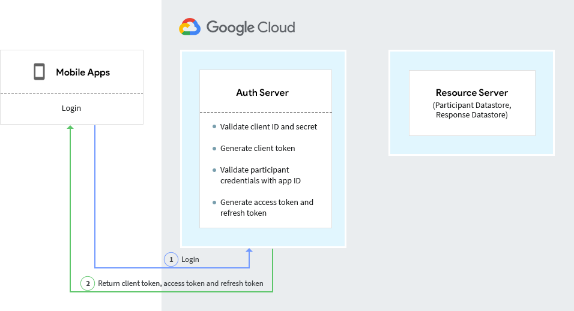
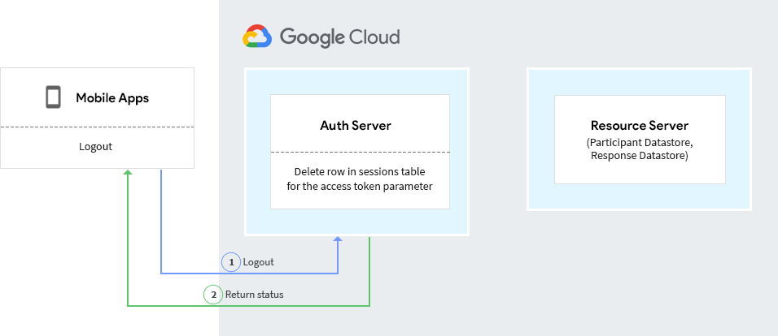
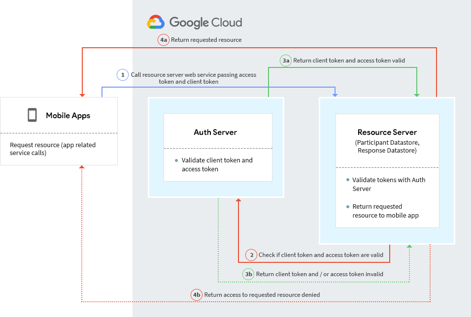
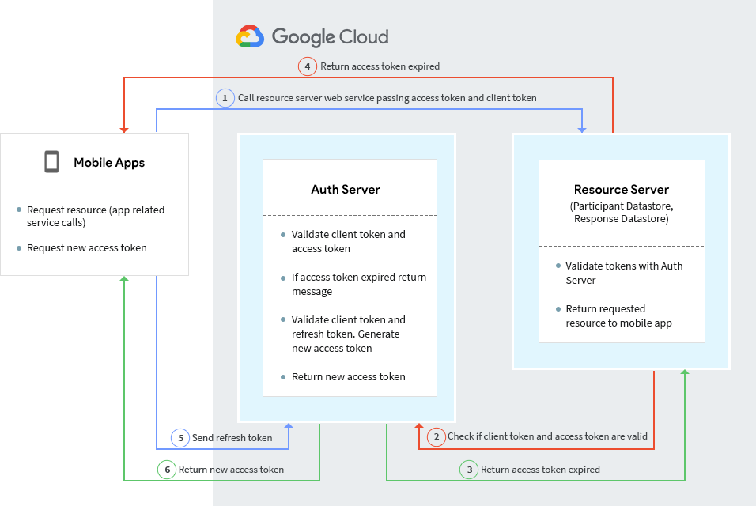

# Application Authentication and Authorization

## Introduction

This article describes the authentication and authorization of the various application components of FDA MyStudies.

*Note: Customers are responsible for setting up users and permissions for both the infrastructural components of the platform (GCP or other infrastructure and/or associated managed services being used in their deployment of the platform) and the application components of the platform for which user management is provided as a feature (this is limited to the Study Builder in the current release).*

The mobile app allows for a self-registration process for its users; however only the users who are found eligible by the app to take part in a study are allowed to proceed with enrollment into the study. Eligibility is determined by means of an in-app eligibility test configured via the Study Builder and/or recognizing the app user as belonging to a pre-screened and pre-identified participation whitelist using an enrollment code. Studies that use the former method of eligibility determination are also referred to as ‘open’ studies in platform terminology, while those that employ the latter or both methods are termed ‘closed’ studies. This release supports only ‘open’ studies as of now. Closed studies will be supported in future releases.

## Terminology

There are three types of users in the FDA MyStudies platform:

1.  Study Builder user - A user of the Study Builder, usually a study or site admin, who is responsible for setting up content for a study.
1.  Study participant - A mobile app user who can use the app to view studies and participate in eligible studies.
1.  Participant Manager user - Targeted for a future release.

## Study Builder Authentication and Authorization 

The Study Builder uses custom authentication built into the application. 

The Study Builder application is seeded with a super admin user, as a part of the deployment process. The super admin user can log into the Study Builder and create other Study Builder users.

A Study Builder user logs in with their email ID and password, which is validated against the Study Builder user data table. The password is hashed before storage. This is a one way hash.

Authorization is managed through the mapping of permissions to users. The database has a set of standard permissions defined, and a subset of these permissions are mapped to a user. The permissions are retrieved and checked when any user action is taken. For example, a user may have permissions to view studies but not edit them, or a user may have access to only a subset of studies in the system.

The permissions set defined for the Study Builder web application are as follows:

*   Super Admin
*   Manage Study Builder Users (Add Users, Edit Users, View Users)
*   Manage Studies (Create Studies, View Studies, Edit Studies)
*   Manage App-Wide Notifications (View Notifications, Edit Notifications)

**Password rules:**

*   Password Strength: Passwords have restrictions that require a minimum size and complexity for the password. 
*   Password Expiry: The application will force the user to change the password every 90 days. The number of days until expiry is a configurable value that is managed in a configuration file.
*   Study Builder users cannot use their last 10 passwords.
*   The password should not contain the user’s account-related information such as the  user’s registered email, first name or last name.
*   Study Builder users will be locked out of an account for a period of one hour after 5 consecutive failed sign-in attempts with incorrect password.

## Study Datastore Authentication and Authorization

The Study Datastore handles study content data and uses basic authentication.

A bundle ID and app token is provided to every client that integrates with the Study Datastore. The bundle ID/app token is unique to a client. The client is responsible for storing the bundle ID and app token, and using them for the web service calls. 

The client follows basic HTTP authentication, where the request to the Study Datastore contains a header field in the form of _Authorization: Basic \<credentials\>_ where credentials is the bundle ID and app token are joined by a colon and converted to a Base64 encoded string. 

The Study Builder web services application validates the credentials on every call.

<table>
  <tr>
   <td>Header Param
   </td>
   <td>Value
   </td>
  </tr>
  <tr>
   <td>Authorization
   </td>
   <td>Basic &ltBase64 encode value (bundleid:apptoken)&gt
   </td>
  </tr>
</table>

The bundle ID and app token are created before deployment and stored in both the Study Datastore and the client application. 

If the bundle ID and/or app token are changed, it will require a redeployment of the Study Datastore and the client application.

## Auth Server Authentication and Authorization

The Auth Server provides centralized authentication and authorization for the following platform components:

1.  Mobile Apps
1.  Participant Datastore
1.  Response Datastore
1.  Participant Manager (targeted for future release)

## Participant Authentication and Authorization

The participant (mobile app user) credentials are a combination of email address and password. In addition, a participant is associated with an app ID and organization ID. 

The app ID and organization ID represent the mobile apps managed by an organization. Each mobile app will have a unique app ID. This app ID is generated by the Study Builder user, who creates an app ID with which studies are associated.

_Note: Organization ID is a placeholder for future enhancements and not used for validation_

### Participant Login

Participants (mobile app users) are authenticated through the login method of the Auth Server web service. The login flow is as follows:

1.  The mobile app is assigned a client ID and secret before deployment, which is managed by the Auth Server. The client ID and secret are stored in the Auth Server database.
1.  The login call to the Auth Server requires the mobile app to pass the client ID, secret, app ID, org ID and the participant credentials.
1.  The Auth Server validates the client ID and secret, and generates a client token for the validated client credentials.
1.  The Auth Server checks the login\_attempts table for the user email and app ID combination, before validating user credentials. It blocks login from the same email ID and app ID if the number of allowed attempts have been exceeded.
1.  If the client credentials are valid, it validates the participant credentials – email, password and the app ID with which the participant is associated.
1.  If the participant credentials are valid and the participant is associated with the right app ID, then the participant is authenticated and authorized for that app.
1.  The server generates an access token, refresh token and client token, along with expiry time, for the access token.
1.  The tokens are returned to the mobile application.
1.  The mobile app is responsible for storing and managing the tokens for subsequent calls.
1.  The Auth Server updates the login attempts table for failed logins, with the participant email and app ID information.

**Password handling and rules:**

1.  Passwords are stored and encrypted in a [non-reversible format](https://en.wikipedia.org/wiki/Bcrypt), using a secure [cryptographic one-way hash function](https://en.wikipedia.org/wiki/Cryptographic_hash_function) (SHA-512) of a [salt](https://en.wikipedia.org/wiki/Salt_(cryptography)) and the password.
1.  A random salt is generated for each password, using Cryptographic Pseudo-Random Number Generator (CPRNG)
1.  The salt is stored in the database
1.  [Password policy](https://en.wikipedia.org/wiki/Password_policy) is enforced before saving in the database
1.  The password must contain 8 to 64 characters, and contain a lowercase letter, upper case letter, numeric character,  and a special character from the set  ! # $ % & \' () \* + , - . : ; < > = ? @ [] ^ \_ { } | ~
1.  The password should not contain the user’s email address
1.  The password history count is 10 meaning the password should not be the same as the last 10 used passwords
1.  Password expiry is 90 days
1.  A mobile app user is locked out of an account for 15 minutes after 5 incorrect password attempts  

### Participant Logout

The mobile app sends a logout request to the Auth Server. The Auth Server then retrieves the access token from the request and clears the row in the sessions table, which has the access token.

### Validate Access Token

1.  When a mobile app requests access to a protected resource, it passes the client token and access token to the resource server.
2.  The resource server sends the client token and the access token to the Auth Server for validation.
3.  The Auth Server validates that the client token and access token are valid and the access token has not expired.
4.  If the tokens are valid, the resource server returns the requested resource.
5.  If the clien token or the access token are not valid, the resource server returns an "Access Denied" message.

### Refresh Access Token

1.  When a mobile app requests access to a protected resource, it passes the client token and access token to the resource server.
2.  If the access token has expired, a message indicating expiry is passed to the resource server.
3.  The resource server passes this message to the mobile app.
4.  The mobile app sends the client token and the refresh token to the Auth Server.
5.  The Auth Server validates the client token and the refresh token.
6.  The Auth Server generates a new access token and returns it to the mobile app.

### Server to Server Authorization

1.  When a server calls another server to access a resource, it uses client credentials for authentication.
1.  Each server has a set of client credentials (client ID and secret) which is maintained by the Auth Server and stored on the server.
1.  The recipient server gets the client ID and secret of the calling server from the request header.
1.  The recipient server calls the Auth Server to validate the client credentials and process the call if the credentials are valid.
1.  The client ID and secret for all Auth Server clients are created before deployment and stored in both the Auth Server database and the client application property file. 
1.  If the client ID and/or secret are changed, it will require a redeployment of the client application.

