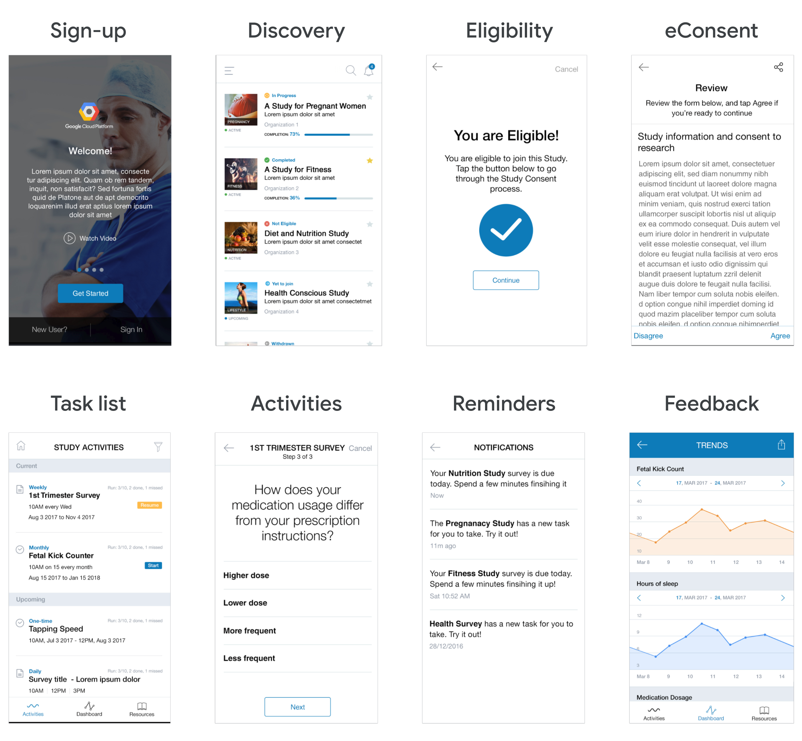

<!--
 Copyright 2020 Google LLC
 Use of this source code is governed by an MIT-style
 license that can be found in the LICENSE file or at
 https://opensource.org/licenses/MIT.
-->

 

# Overview
This directory contains all the code necessary to build the **FDA MyStudies** iOS application for study participants. Customization of the [`Default.xcconfig`](MyStudies/MyStudies/Default.xcconfig) and [`Branding.plist`](MyStudies/MyStudies/Branding/Generic/Branding.plist) files will enable your iOS application to interact with the other components of your **FDA MyStudies** deployment. Further customization of app branding can be accomplished by replacing the default application images with your own. All configuration related to the creation and operation of studies is done using the [`Study builder`](../study-builder/) without need for code changes or redeployment of the mobile application.

<!--TODO A demonstration of the iOS mobile application can be found [here](todo). --->

# Requirements
The **FDA MyStudies** iOS application requires [Xcode 11](https://developer.apple.com/xcode/) or newer, and can be run on iOS versions 11 and above.

# Platform integration
The **FDA MyStudies** mobile application fetches all study, schedule, activity, eligibility, consent and notification information from the [`Study datastore`](../study-datastore/) and posts pseudonymized participant response data to the [`Response datastore`](../response-datastore/). Consent forms and any other identifiable data is posted to the [`Participant datastore`](../participant-datastore/). Email and password authentication is handled by the MyStudies [`Auth server`](../auth/) using OAuth 2.0.

# Configuration instructions
1. Open the [`iOS/MyStudies/MyStudies.xcworkspace`](MyStudies/MyStudies.xcworkspace) in Xcode
1. Map your project’s [build configuration](https://help.apple.com/xcode/mac/current/#/dev745c5c974) to [`iOS/MyStudies/MyStudies/Default.xcconfig`](MyStudies/MyStudies/Default.xcconfig) following [these instructions](https://help.apple.com/xcode/mac/current/#/deve97bde215?sub=devf0d495219)
1. Update the following in the [`Default.xcconfig`](MyStudies/MyStudies/Default.xcconfig) file:
    -    Update `STUDY_DATASTORE_URL` with your [`Study datastore`](../study-datastore) URL
    -    Update `RESPONSE_DATASTORE_URL` with your [`Response datastore`](../response-datastore/) URL
    -    Update `USER_DATASTORE_URL` with your [`User datastore`](../participant-datastore/user-mgmt-module/) URL
    -    Update `ENROLLMENT_DATASTORE_URL` with your [`Enrollment datastore`](../participant-datastore/enroll-mgmt-module/) URL
    -    Update `CONSENT_DATASTORE_URL` with your [`Consent datastore`](../participant-datastore/consent-mgmt-module/) URL
    -    Update `AUTH_URL` with your [`Auth server`](../auth-server/) URL
    -    Update `HYDRA_BASE_URL` with your [`Hydra server`](../hydra/) URL
    -    Update `HYDRA_CLIENT_ID` with the `client_id` you configured during [`Hydra`](/hydra/) deployment (the mobile applications share a `client_id` with each other and the `Participant manager`) 
    -    Update `API_KEY` with the `bundle_id` and `app_token` that you configured [`study-datastore/src/main/resources/authorizationResource.properties`](../study-datastore/src/main/resources/authorizationResource.properties) during [`Study datastore`](/study-datastore/) deployment with format *<value of ios.bundleid>:<value of ios.apptoken>
    -    Update `APP_ID` with the `AppId` configured in the [`Study builder`](../study-builder)
    -    Set `APP_TYPE` to either “gateway” or “standalone” (*standalone* applications hold a single study while *gateway* applications manage multiple studies)
    -    Update `STUDY_ID` key with the `StudyId` configured by the study administrator in the `Study builder` user interface (not required for *gateway* applications)
    -    Set `APP_ID` to the value configured by the study administrator in the `Study builder` user interface
1. Enable push notifications
    -    Create [push notification certificates](https://help.apple.com/developer-account/#/dev82a71386a) in encrypted `.p12` format
    -    Update the `ios_certificate` and `ios_certificate_password` fields in the [`participant-datastore/sqlscript/mystudies_app_info_update_db_script.sql`](../participant-datastore/sqlscript/mystudies_app_info_update_db_script.sql) script
    -    Run the updated [`mystudies_app_info_update_db_script.sql`](sqlscript/mystudies_app_info_update_db_script.sql) script on the `mystudies_participant_datastore` database that you created during [`Participant datastore`](/participant-datastore/) deployment  ([instructions](https://cloud.google.com/sql/docs/mysql/import-export/importing#importing_a_sql_dump_file))
    -    For more information, visit [Establishing a Certificate-Based Connection to APNs](https://developer.apple.com/documentation/usernotifications/setting_up_a_remote_notification_server/establishing_a_certificate-based_connection_to_apns)
1. *Optional.* Customize images and text
    -    Replace icons and images in [`iOS/MyStudies/MyStudies/Assets/Assets.xcassets`](MyStudies/MyStudies/Assets/Assets.xcassets/)
    -    Update user-facing text in the [`iOS/MyStudies/MyStudies/Branding/Generic/Branding.plist`](MyStudies/MyStudies/Branding/Generic/Branding.plist) file, fields to consider include:
         -    `ProductTitleName` - Application name that is shown to the user
         -    `WebsiteButtonTitle` - Text of the link that is shown on the overview screen
         -    `WebsiteLink` - Destination of the link that is shown on the overview screen
         -    `TermsAndConditionURL` - Destination for the terms and conditions link
         -    `PrivacyPolicyURL` - Destination for the privacy policy link
         -    `NavigationTitleName` - The navigation bar title that is shown to users
    -    Update introductory information presented to users in the [`iOS/MyStudies/MyStudies/Utils/Resources/Plists/UI/GatewayOverview.plist`](MyStudies/MyStudies/Utils/Resources/Plists/UI/GatewayOverview.plist) file
    -    Additional resource documents can be made available to users by adding PDF files to [`iOS/MyStudies/MyStudies/Assets/OtherAssets/`](MyStudies/MyStudies/Assets/OtherAssets/) and creating a corresponding entry in [`iOS/MyStudies/MyStudies/Models/Resource/Resources.plist`](MyStudies/MyStudies/Models/Resource/Resources.plist)

# Building and deploying

Instructions for building and deploying iOS applications can be found [here](https://help.apple.com/xcode/mac/current/#/devdc0193470).

***

Copyright 2020 Google LLC

