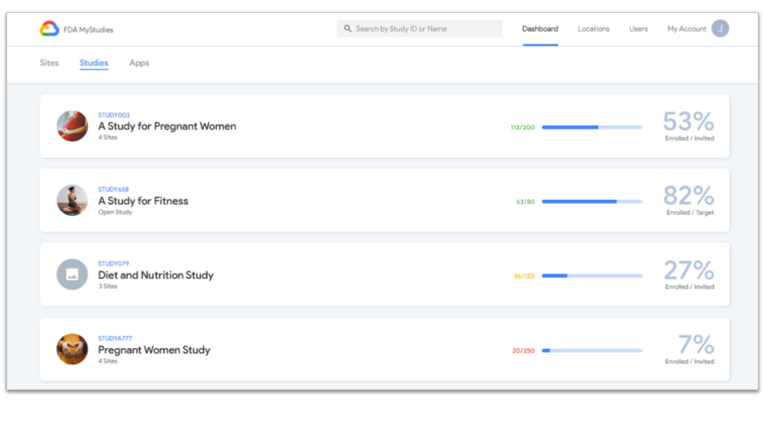

<!--
 Copyright 2020 Google LLC
 Use of this source code is governed by an MIT-style
 license that can be found in the LICENSE file or at
 https://opensource.org/licenses/MIT.
-->
 
# Overview
The **FDA MyStudies** [`Participant manager`](/participant-manager/) is a web application that provides a no-code user interface for researchers, clinicians and other study coordinators to track and manage the progress of participant enrollment across sites and studies. Study coordinators use the `Participant manager` to add participants to studies and view participant enrollment and consent status. Study coordinators also use the `Participant manager` to create study sites, and assign sites to studies. The `Participant manager` is an Angular web application that uses the [Participant manager datastore](../participant-manager-datastore) as the application backend. The `Participant manager` uses basic authentication `client_id` and `client_secret` managed by [`Hydra`](/hydra/) to interact with the `Participant manager datastore`.
 
The `Participant manager` provides the following functionality:
1. Create and manage study coordinator accounts
1. Create and manage study sites
1. Assign studies to sites
1. Add participants to studies
1. View participant enrollment status
1. View participant consent forms
1. Visualize study and site enrollment

<!-- A detailed user-guide for how to configure your first study can be found [here](TODO) --->
 
<!--A demonstration of the `Participant manager` application can be found [here](TODO). --->
 
Example screens:

 
# Deployment
> **_NOTE:_** Holistic deployment of the **FDA MyStudies** platform with Terraform and infrastructure-as-code is the recommended approach to deploying this component. A step-by-step guide to semi-automated deployment can be found in the [`deployment/`](/deployment) directory. The following instructions are provided in case manual deployment in a VM is required. Google Cloud infrastructure is indicated, but equivalent alternative infrastructure can be used as well. It is important for the deploying organization to consider the identity and access control choices made when configuring the selected services. If pursuing a manual deployment, a convenient sequence is [`hydra/`](/hydra)&rarr;[`auth-server/`](/auth-server/)&rarr;[`participant-datastore/`](/participant-datastore/)&rarr;[`participant-manager-datastore/`](/participant-manager-datastore/)&rarr;[`participant-manager/`](/participant-manager/)&rarr;[`study-datastore/`](/study-datastore/)&rarr;[`response-datastore/`](/response-datastore/)&rarr;[`study-builder/`](/study-builder/)&rarr;[`Android/`](/Android/)&rarr;[`iOS/`](/iOS/).
 
To deploy the [`Participant manager`](/participant-manager/) manually:
1. [Create](https://cloud.google.com/compute/docs/instances/create-start-instance) a Compute Engine VM instance and [reserve a static IP](https://cloud.google.com/compute/docs/ip-addresses/reserve-static-internal-ip-address)
1. Check out the latest code from the [FDA MyStudies repository](https://github.com/GoogleCloudPlatform/fda-mystudies/)
1. Deploy the `Participant manager` container to the VM
    -    Update the [`environment.prod.ts`](src/environments/environment.prod.ts) file with the values for your deployment (if you change this file you will need to create a new Docker image)
    -    Create the Docker image using `sudo docker build -t participant-manager-image .` from the `participant-manager/` directory (you may need to [install Docker](https://docs.docker.com/engine/install/debian/))
    -    Run the container on the VM using `sudo docker run --detach -p 80:80 --name participant-manager participant-manager-image`
1. Visit `http://<CLOUD_VM_INSTANCE_IP>/participant-manager` in your browser to test if the application is running - you should be redirected to the login page if deployed successfully (you can install a [browser and remote desktop connection](https://cloud.google.com/solutions/chrome-desktop-remote-on-compute-engine) if your VM is restricted to IPs within its VPC network, alternatively use `curl -i http://0.0.0.0/` to confirm a `200 OK` response)
1. Login as the super admin user with the username and password that you created with the `create_superadmin.sh` script that you ran during `Participant datastore` deployment
1. Use the `Participant manager` user interface to create additional administrator accounts as needed

***

Copyright 2020 Google LLC

