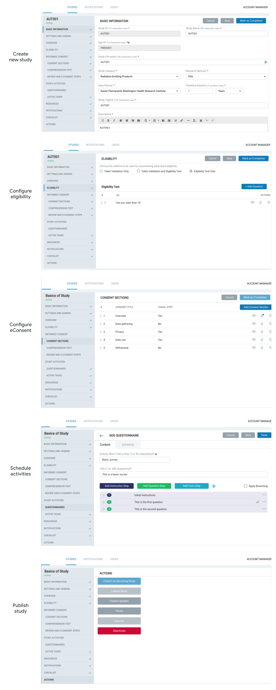

<!--
 Copyright 2020-2021 Google LLC
 Use of this source code is governed by an MIT-style
 license that can be found in the LICENSE file or at
 https://opensource.org/licenses/MIT.
-->
 
# Overview
The **FDA MyStudies** [`Study builder`](/study-builder/) is a web application that provides a no-code user interface for researchers, clinicians and other study administrators to create and launch studies. As study administrators make changes to their studies using the `Study builder`, those changes are propagated to the participant mobile applications without need for code changes or app updates. The `Study builder` configures the content of your organization’s studies - it does not process participant data. The `Study builder` is a Java application built on the Spring framework. The backend database is a MySQL database, which is shared with the [`Study datastore`](/study-datastore/). The `Study datastore` serves the study content and configuration to the study’s mobile applications, which study participants use to interact with the study. The `Study builder` application uses built-in authentication and authorization.
 
The `Study builder` provides the following functionality:
1. Study administrator registration, login and logout
1. Creation and configuration of new studies (including eligibility, eConsent, activities and schedule)
1. Assignment of studies to mobile applications
1. Editing content and configuration of existing studies
1. Starting, pausing and ending studies
1. Sending notifications to study participants
 
<!-- A detailed user-guide for how to configure your first study can be found [here](TODO) --->
 
<!--TODO A demonstration of the `Study builder` application can be found [here](todo). --->
 
Example screens:

 
# Deployment
> **_NOTE:_** Holistic deployment of the **FDA MyStudies** platform with Terraform and infrastructure-as-code is the recommended approach to deploying this component. A step-by-step guide to semi-automated deployment can be found in the [`deployment/`](/deployment) directory. The following instructions are provided in case manual deployment in a VM is required. Google Cloud infrastructure is indicated, but equivalent alternative infrastructure can be used as well. It is important for the deploying organization to consider the identity and access control choices made when configuring the selected services. If pursuing a manual deployment, a convenient sequence is [`hydra/`](/hydra)&rarr;[`auth-server/`](/auth-server/)&rarr;[`participant-datastore/`](/participant-datastore/)&rarr;[`participant-manager-datastore/`](/participant-manager-datastore/)&rarr;[`participant-manager/`](/participant-manager/)&rarr;[`study-datastore/`](/study-datastore/)&rarr;[`response-datastore/`](/response-datastore/)&rarr;[`study-builder/`](/study-builder/)&rarr;[`Android/`](/Android/)&rarr;[`iOS/`](/iOS/).
 
To deploy the [`Study builder`](/study-builder/) manually:
1. [Create](https://cloud.google.com/compute/docs/instances/create-start-instance) a Compute Engine VM instance with a [static IP](https://cloud.google.com/compute/docs/ip-addresses/reserve-static-internal-ip-address) and read/write [access scopes](https://cloud.google.com/compute/docs/access/service-accounts#accesscopesiam) for Cloud Storage (make sure your VM’s [GCE service account](https://cloud.google.com/compute/docs/access/service-accounts#default_service_account) has the [`Storage Object Admin`](https://cloud.google.com/storage/docs/access-control/iam-roles) role for the bucket you created during `Study datastore` deployment)
1. Verify that your VM instance has the `Stackdriver Logging API` write [access scope](https://cloud.google.com/compute/docs/access/service-accounts#accesscopesiam) (on by default) and that your VM’s [service account](https://cloud.google.com/compute/docs/access/service-accounts#default_service_account) has the [`Logs Writer`](https://cloud.google.com/logging/docs/access-control) role (off by default)
1. Check out the latest code from the [FDA MyStudies repository](https://github.com/GoogleCloudPlatform/fda-mystudies/)
1. Optional. Customize branding by updating text and images
	-    Update user-facing text as desired, for example in [`termsAndCondition.jsp`](fdahpStudyDesigner/src/main/webapp/WEB-INF/view/termsAndCondition.jsp), [`copyright.jsp`](fdahpStudyDesigner/src/main/webapp/WEB-INF/templates/copyright.jsp) and [`privacypolicy.jsp`](fdahpStudyDesigner/src/main/webapp/WEB-INF/view/privacypolicy.jsp)
	-	 Replace landing page image [`logo_landing_welcome.png`](fdahpStudyDesigner/src/main/webapp/images/logo/logo_landing_welcome.png) (do not change filename)
	- 	 Replace subpage image [`logo_innerScreens.png`](fdahpStudyDesigner/src/main/webapp/images/logo/logo_innerScreens.png) (do not change filename)
	-    Replace favicon image [`FAV_Icon.png`](fdahpStudyDesigner/src/main/webapp/images/icons/FAV_Icon.png) (do not change filename)
1. Deploy the `Study builder` container to the VM
    -    Create the Docker image using `sudo mvn -B package -Pprod com.google.cloud.tools:jib-maven-plugin:2.5.2:dockerBuild -f fdahpStudyDesigner/pom.xml -Dimage=study-builder-image` (you may need to [install Docker](https://docs.docker.com/engine/install/debian/) and Maven, for example `sudo apt install maven`)
    -    Update the Docker environment file [`variables.env`](variables.env) with values to configure the [`application.properties`](fdahpStudyDesigner/src/main/resources/application.properties) file for your deployment
    -    Run the container on the VM using `sudo docker run --detach --env-file variables.env -p 80:8080 --name study-builder study-builder-image`
    -    If your `Auth server` instance is a using self-signed certificate, add that certificate to your container’s keystore, for example with `sudo docker exec -it study-builder bash -c "openssl s_client -connect <your_auth_server_instance:port> | sed -ne '/-BEGIN CERTIFICATE/,/END CERTIFICATE/p' > auth-server.crt; keytool -import -trustcacerts -alias auth-server -file auth-server.crt -keystore /usr/local/openjdk-11/lib/security/cacerts -storepass changeit"`, then restart the container with `sudo docker restart study-builder`
1. Visit `http://<CLOUD_VM_INSTANCE_IP>/studybuilder` in your browser to test if the application is running - you should be redirected to the login page if deployed successfully 
    -    If access to your VM is restricted to IPs within its VPC network, you can make a [remote desktop connection](https://cloud.google.com/solutions/chrome-desktop-remote-on-compute-engine) to a machine within your VPC (alternatively use `curl -i http://0.0.0.0/studybuilder` to confirm a `302` redirect response)
1. Login as the super admin user with the username and password that you created with the `create_superadmin.sh` script
1. Use the `Study builder` user interface to create additional administrator accounts as needed
1. You can review application logs in the logging directories you specified, or with `sudo docker logs study-builder`; audit logs are available in [Cloud Logging](https://cloud.google.com/logging)
 
> **_NOTE:_** You will need to publish at least one study with an `App ID` to enable the mobile applications to create participant accounts. If you published a study before completing deployment of the other platform services, you may need to pause and then resume that study for its settings to propagate across the platform.  

***

Copyright 2020 Google LLC

